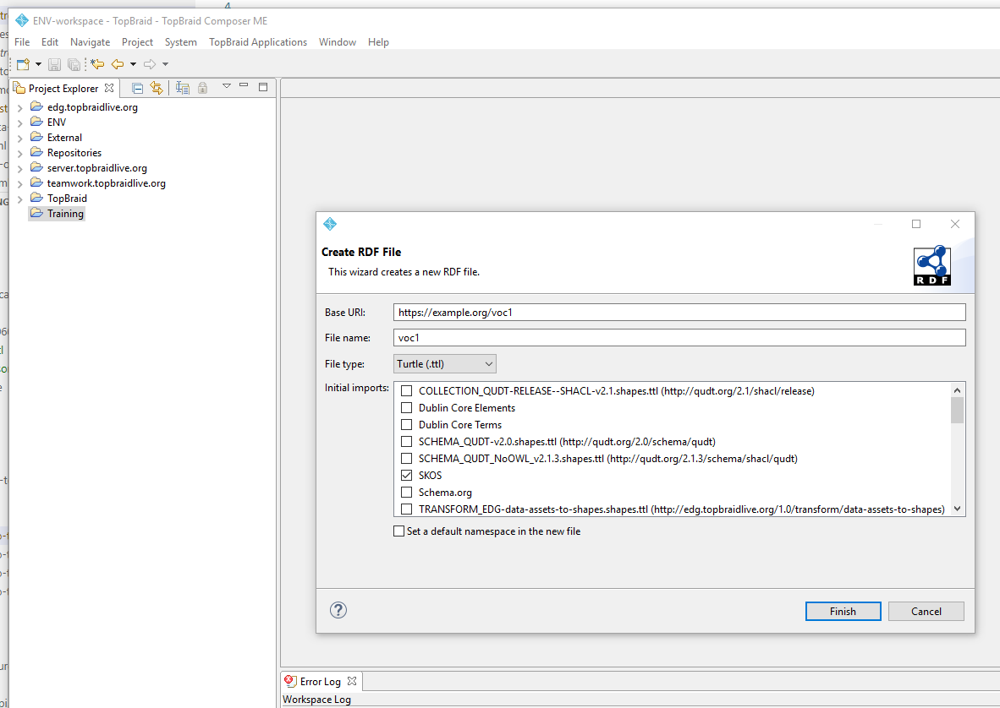
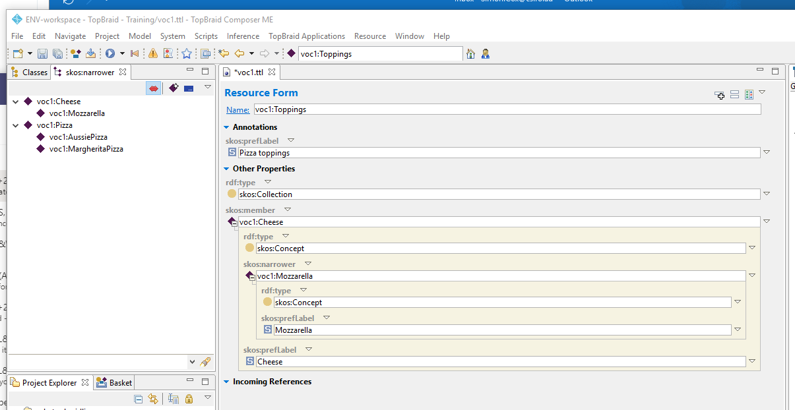

# Introduction to controlled vocabularies using SKOS

## Materials for hands-on session

- [SKOS schema](http://www.w3.org/TR/skos-reference/skos.rdf) 
  - URL http://www.w3.org/TR/skos-reference/skos.rdf
- [MD_TopicCategoryCode SKOS](http://registry.it.csiro.au/def/isotc211/MD_TopicCategoryCode?_format=ttl) ([web page](http://registry.it.csiro.au/def/isotc211/MD_TopicCategoryCode))
  - URL http://registry.it.csiro.au/def/isotc211/MD_TopicCategoryCode?_format=ttl
- [IUGS Simple Lithology SKOS](https://geosciml.org/resource/vocabulary/cgi/2016/simplelithology.rdf) ([web page](http://cgi.vocabs.ga.gov.au/object?uri=http://resource.geosciml.org/classifier/cgi/lithology)
  - URL https://geosciml.org/resource/vocabulary/cgi/2016/simplelithology.rdf
- [Landform classifiers SKOS](http://registry.it.csiro.au/def/soil/au/asls/landform?_format=ttl) ([web page](http://registry.it.csiro.au/def/soil/au/asls/landform))
  - URL http://registry.it.csiro.au/def/soil/au/asls/landform?_format=ttl
- [Geological timescale](https://stratigraphy.org/icschart/ChronostratChart2020-03.pdf)
- [Geological timescale schema](http://resource.geosciml.org/ontology/timescale/gts)
- [Geological timescale 2020 SKOS](https://raw.githack.com/CGI-IUGS/timescale-data/master/rdf/isc2020.ttl) ([web page](https://vocabs.ardc.edu.au/viewById/196))
  - URL https://raw.githack.com/CGI-IUGS/timescale-data/master/rdf/isc2020.ttl 

## TBC Screenshots

### 1. Create a new RDF/SKOS file

### 2. Create your first SKOS Concept

### 3. Add a narrower Concept

### 4. Show the Concept tree

### 5. Create toppings

