# Tutorial: Introduction to RDF and OWL

A tutorial to introduce RDF and OWL concepts using 
the TopBraid Composer (Free) Editor. 

In this tutorial, we will learn to:
1. Build a very simple Pizza ontology from scratch
2. Import an ontology into the Topbraid editor
3. Begin querying data using RDF and OWL

<!-- TOC depthFrom:2 -->

- [Tutorial: Introduction to RDF and OWL](#tutorial-introduction-to-rdf-and-owl)
  - [Learning Objectives](#learning-objectives)
  - [Pre-requisites and assumptions](#pre-requisites-and-assumptions)
  - [Part 1. Creating a simple Pizza ontology using RDF and OWL (15-20mins)](#part-1-creating-a-simple-pizza-ontology-using-rdf-and-owl-15-20mins)
    - [Exercise 1. Building your simple Pizza ontology](#exercise-1-building-your-simple-pizza-ontology)
      - [1.1. Create your first class: Pizza class](#11-create-your-first-class-pizza-class)
      - [1.2. Create more  classes](#12-create-more-classes)
      - [1.3. Create hasTopping object property Pizza subclasses](#13-create-hastopping-object-property-pizza-subclasses)
      - [1.4. Create the `MargheritaPizza` class](#14-create-the-margheritapizza-class)
      - [Extra exercise](#extra-exercise)
  - [Part 2. Import an existing ontology into the Topbraid editor (15-20mins)](#part-2-import-an-existing-ontology-into-the-topbraid-editor-15-20mins)
    - [Exercise 2. Import the Pizza ontology and explore its features](#exercise-2-import-the-pizza-ontology-and-explore-its-features)
      - [2.1. Import the Pizza ontology :](#21-import-the-pizza-ontology-)
      - [For discussion:](#for-discussion)
      - [Extra exercise](#extra-exercise-1)
  - [Part 3. Query the RDF data using SPARQL in Topbraid (15-20mins)](#part-3-query-the-rdf-data-using-sparql-in-topbraid-15-20mins)
    - [Introducing SPARQL](#introducing-sparql)
      - [Anatomy of a SPARQL SELECT query](#anatomy-of-a-sparql-select-query)
    - [Exercise 3: Querying the Pizza ontology using SPARQL](#exercise-3-querying-the-pizza-ontology-using-sparql)
      - [3.1. Query the Pizza ontology and list the direct subclasses of `pizza:Pizza`](#31-query-the-pizza-ontology-and-list-the-direct-subclasses-of-pizzapizza)
      - [3.2. Query the Pizza ontology and list all subclasses of `pizza:Pizza` (direct and indirect)](#32-query-the-pizza-ontology-and-list-all-subclasses-of-pizzapizza-direct-and-indirect)
      - [3.3. Find all Pizza classes that have `TomatoTopping`](#33-find-all-pizza-classes-that-have-tomatotopping)
      - [3.4. Try to create a SPARQL query to find Pizzas that has a `GarlicTopping`](#34-try-to-create-a-sparql-query-to-find-pizzas-that-has-a-garlictopping)
      - [3.5. (Advanced) Find all Pizza classes that have `TomatoTopping` and all types of classes of `FishTopping`](#35-advanced-find-all-pizza-classes-that-have-tomatotopping-and-all-types-of-classes-of-fishtopping)
    - [Going deeper](#going-deeper)
  - [References](#references)

<!-- /TOC -->

## Learning Objectives

Attendees will:
* Understand some of the RDF and OWL language elements, and their explicit semantics
* Learn basic elements of information modelling using OWL
* Gain hands-on experience with ontology development and querying using Topbraid Composer tools
* Learn the facets of the SPARQL language and how to query using SPARQL

## Pre-requisites and assumptions

* Topbraid Composer Free installed
* Familiarity with OWL and RDF

## Part 1. Creating a simple Pizza ontology using RDF and OWL (15-20mins)

Objective: Creating a simple Pizza ontology in RDF and OWL using 
Topbraid Composer

In this part of the tutorial, we will be creating a simple Pizza ontology. Before we start using the Topbraid Composer tool, we'll need an information model to guide us.

The figure below shows a suggested information model for a simple Pizza ontology. We have 2 main classes, called `Pizza` and `PizzaTopping` and we'll be creating 2 pizza types - the classic, `MargheritaPizza` (which, according to legend, in 1889 was created and named after her...) and the `AussiePizza` (a local favourite).

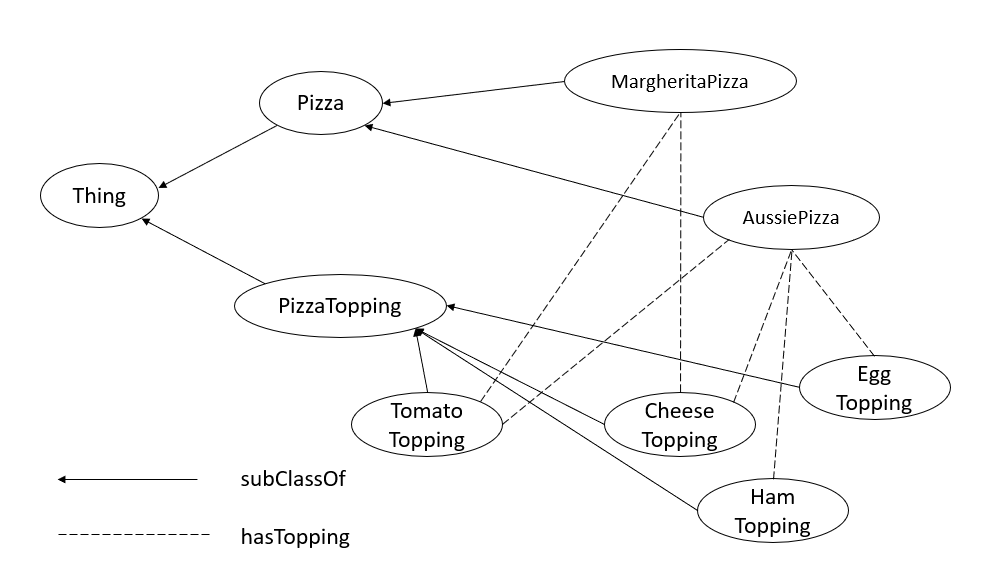


### Exercise 1. Building your simple Pizza ontology

#### 1.1. Create your first class: Pizza class 

Fire up Topbraid Composer. We'll be creating:
* A new project, called "Pizza"
* A new RDF file, called "mypizza"

In your new RDF 'mypizza' file, create a new class. 


#### 1.2. Create more  classes

Create a sibling class called `PizzaTopping` and the remaining topping subclasses, 
e.g. CheeseTopping, HamTopping, TomatoTopping, EggTopping


It should look like this:

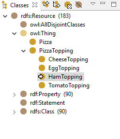

#### 1.3. Create hasTopping object property Pizza subclasses

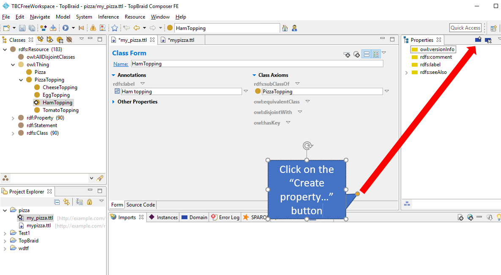

Select `owl:ObjectProperty` in the in the `Create property` panel.
Add the name of the property in the text field, i.e. hasTopping.
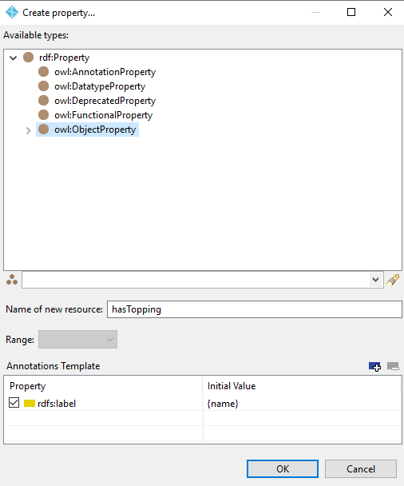

This creates an OWL Object Property which can be used to relate two classes

#### 1.4. Create the `MargheritaPizza` class

Create a new subclass of the `Pizza` class as you did earlier with the other classes.

We now want to add more semantics to the `MargheritaPizza` class to express that it has a relationship with the `TomatoTopping` and the `CheeseTopping`. To do so, we need to introduce the idea of a *Class Restriction*.

To understand *Class Restrictions*, it's useful to think about it in terms of a Venn diagram. See below:

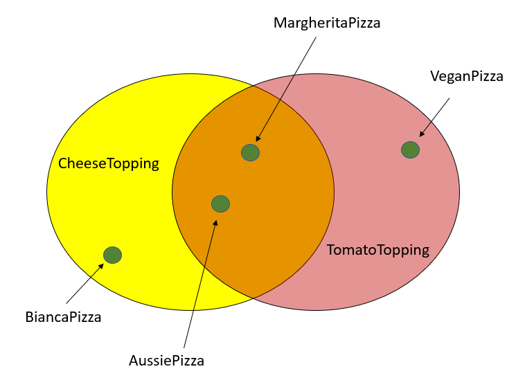

In OWL, we use Description Logic to capture class semantics. We use class restrictions to narrow down the possible logical statements about that class. Using the MargheritaPizza example, we know that it is a pizza that has cheese and tomato toppings. To express this, we create a restriction on the subClassOf property for MargheritaPizza with the following:
* There exists a class where the `hasTopping` property is `CheeseTopping`
* There exists a class where the `hasTopping` property is `TomatoTopping`

The other example in the diagram show that, the `BiancaPizza` is a pizza that has CheeseTopping but no TomatoTopping, and we can express that using subClassOf restrictions. 

Therefore, we can use software reasoners to infer a list of pizzas which has no TomatoToppings, which would include the BiancaPizza. Similarly, we can use software reasoners to infer a list of pizzas which has CheeseToppings, which would include the BiancaPizza, AussiePizza and the MargheritaPizza.

To create a subClassOf restriction, click on the dropdown button on the `rdfs:subClassOf` field, and select "Create restriction".

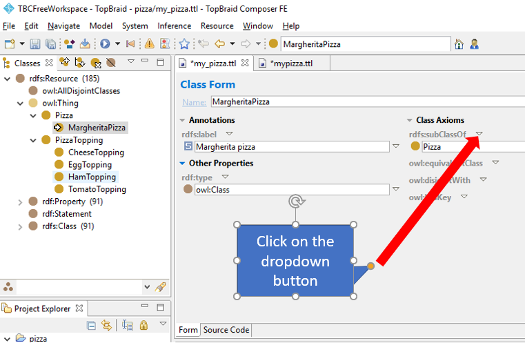

Select the "hasTopping" property, and the "someValuesFrom" Restriction Type.
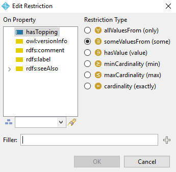

We now need to specify the PizzaTopping classes for MargheritaPizza. 

Click on the "+" button in the "Filler" field and select "CheeseTopping".

Repeat for "TomatoTopping".


#### Extra exercise

Create a new class called `AussiePizza` and create subClassOf restrictions of `hasTopping` with `CheeseTopping`, `TomatoTopping`, `EggTopping` and `HamTopping`


## Part 2. Import an existing ontology into the Topbraid editor (15-20mins)

Often you won't be creating an ontology from scratch, but rather importing this into your workspace. In this part of the tutorial, we will import the *Pizza ontology* created by the University of Manchester which was developed for learning OWL. 


### Exercise 2. Import the Pizza ontology and explore its features

In the current project, create a new RDF file, called "pizza"


#### 2.1. Import the Pizza ontology :

In your new RDF 'pizza' file, import the Pizza ontology from this URL:
[https://protege.stanford.edu/ontologies/pizza/pizza.owl](https://protege.stanford.edu/ontologies/pizza/pizza.owl)

To import the Pizza ontology, navigate to the `Imports` tab and click on the "`Import from URL`" button.
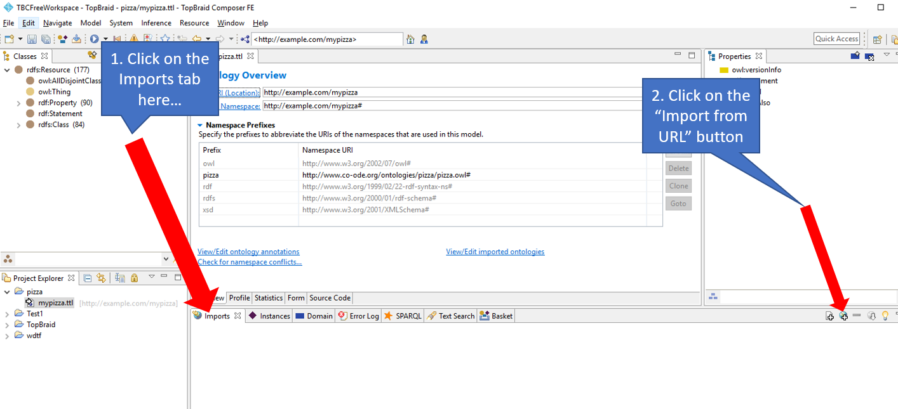


Enter in the Pizza ontology URL (see above) into the text input box like so:
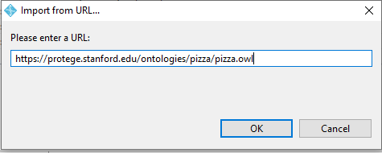

The imported Pizza ontology will appear in the Imports tab like so:
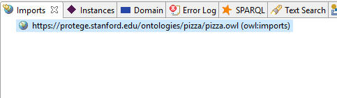

#### For discussion: 
* Take a few moments to navigate around the Pizza ontology
* What do you notice about the Margherita Pizza definition?

#### Extra exercise

Create a new class called `AussiePizza` by extending the framework in the imported pizza ontology


## Part 3. Query the RDF data using SPARQL in Topbraid (15-20mins)

Objective: Learn how to write simple SPARQL queries to understand RDF data using Topbraid Composer

The part of the tutorial aims to provide a very quick overview of SPARQL and write some simple queries. We will focus on SPARQL SELECT queries.

### Introducing SPARQL

SPARQL = SPARQL Protocol and RDF Query Language (pronounced "spar-kle")

SPARQL is a structured query language that is used to query RDF data, much like SQL is used to query relational databases. There are 4 query forms: 
* SELECT - used to get RDF values in a tabular result form
* CONSTRUCT - create a RDF graph based on returned RDF graph values 
* ASK - returns a simple boolean (true/false) result 
* DESCRIBE - get a descriptive RDF graph (usually up to the query engine to define returned result)

For the purposes of this tutorial, we'll explore using SPARQL SELECT query

#### Anatomy of a SPARQL SELECT query

The SPARQL query takes the form 

```
SELECT [ list of variables delimited by a space ]
WHERE 
{
    [ 
          list triple statements separated by '.'
    ]
}
```

Example:
```
SELECT ?subject1 ?subject2
WHERE 
{
    ?subject1 ?predicate1 ?object1 . 
    ?subject2 ?predicate2 ?object2 . 
}
```

A list of rows will be returned based on the list of variables in the SELECT line. 
In the example above, rows with columns of `?subject1` `?subject2` will be returned. e.g.

```
| ?subject1 | ?subject2 |
-------------------------
| "foo"     |  'bar"    |
-------------------------
```

### Exercise 3: Querying the Pizza ontology using SPARQL

Using the imported Pizza ontology from Part 2, select the `SPARQL` tab like so:
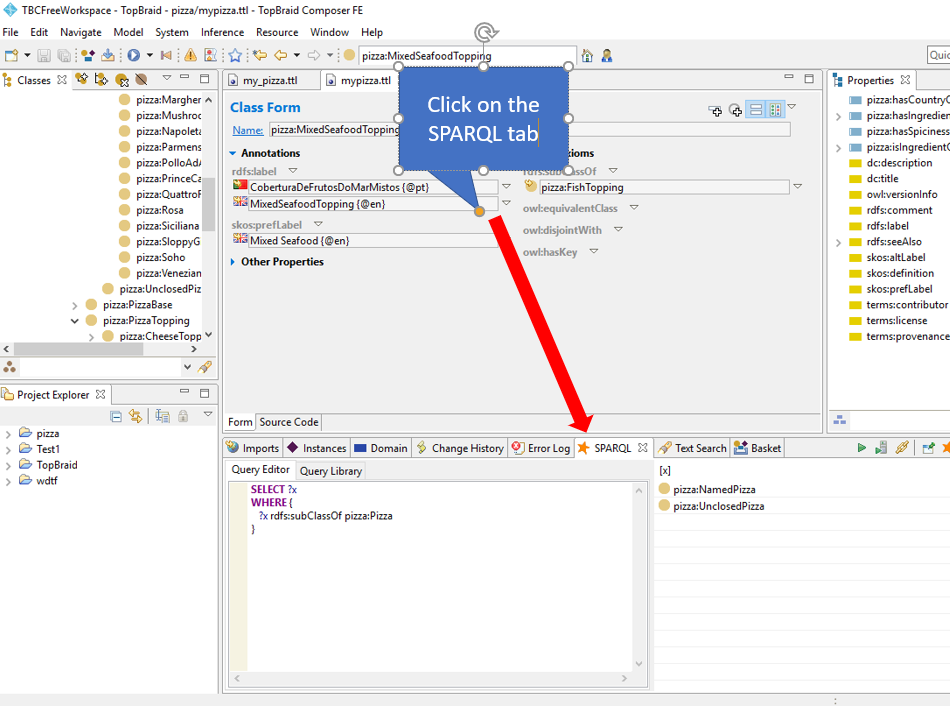

Use the queries below to get hands-on with SPARQL SELECT queries with the Pizza ontology.

#### 3.1. Query the Pizza ontology and list the direct subclasses of `pizza:Pizza`
```
SELECT ?x 
WHERE {
   ?x rdfs:subClassOf pizza:Pizza
}
```

Discuss: What's happening here?


#### 3.2. Query the Pizza ontology and list all subclasses of `pizza:Pizza` (direct and indirect)
```
SELECT ?x 
WHERE {
   ?x rdfs:subClassOf+ pizza:Pizza
}
```
Discuss: What's happening here?

#### 3.3. Find all Pizza classes that have `TomatoTopping` 
```
SELECT ?x 
WHERE {
   ?x rdfs:subClassOf+ pizza:Pizza .
   ?x rdfs:subClassOf [
		a owl:Restriction ;
		owl:onProperty pizza:hasTopping; 
        owl:someValuesFrom pizza:TomatoTopping 
	]
}
```
Discuss: What's happening here?

#### 3.4. Try to create a SPARQL query to find Pizzas that has a `GarlicTopping`

```

```

#### 3.5. (Advanced) Find all Pizza classes that have `TomatoTopping` and all types of classes of `FishTopping`
```
SELECT ?x 
WHERE {
   ?x rdfs:subClassOf+ pizza:Pizza .
   ?x rdfs:subClassOf [
		a owl:Restriction ;
		owl:onProperty pizza:hasTopping; 
        owl:someValuesFrom pizza:TomatoTopping 
	] .
	  ?x rdfs:subClassOf [
		a owl:Restriction ;
		owl:onProperty pizza:hasTopping; 
        owl:someValuesFrom ?fishClasses
	] .
    ?fishClasses rdfs:subClassOf+ pizza:FishTopping 
}
```

Discuss: What's happening here?


### Going deeper

If you would like to explore more about SPARQL, we'd recommend the following tutorial: 
[SPARQL Tutorial by Apache Jena](https://jena.apache.org/tutorials/sparql.html)

## References

Check out the [Learning resources](../learning-resources.md) section for more material.

Other related pages:
* SPARQL
  * [W3C SPARQL Specification](https://www.w3.org/TR/rdf-sparql-query/)
  * 
