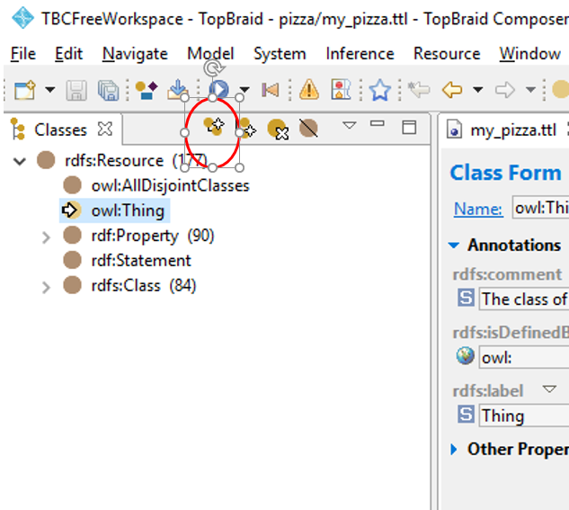
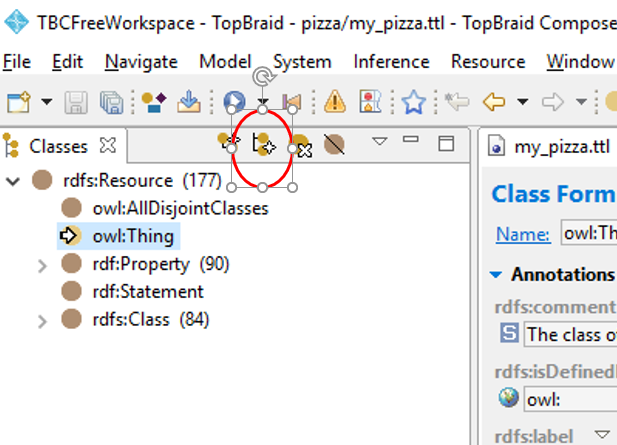

# Tutorial: Introduction to RDF and OWL

A tutorial to introduce RDF and OWL concepts using 
the TopBraid Composer (Free) Editor. 

In this tutorial, we will learn to:
1. Build a very simple Pizza ontology from scratch
2. Import an ontology into the Topbraid editor
3. Begin querying data using RDF and OWL

## Learning Objectives

Attendees will:
* Understand some of the RDF and OWL language elements, and their explicit semantics
* Learn basic elements of information modelling using OWL
* Gain hands-on experience with ontology development and querying using Topbraid Composer tools
* Learn the facets of the SPARQL language and how to query using SPARQL

## Pre-requisites and assumptions

* Topbraid Composer Free installed
* Familiarity with OWL and RDF

## Part 1. Creating a simple Pizza ontology using RDF and OWL (15-20mins)

Objective: Creating a simple Pizza ontology in RDF and OWL using 
Topbraid Composer

In this part of the tutorial, we will be creating a simple Pizza ontology. Before we start using the Topbraid Composer tool, we'll need an information model to guide us.

The figure below shows a suggested information model for a simple Pizza ontology. We have 2 main classes, called `Pizza` and `PizzaTopping` and we'll be creating 2 pizza types - the classic, `MargheritaPizza` (which, according to legend, in 1889 was created and named after her...) and the `AussiePizza` (a local favourite).


### Exercise 1. 

1.1. Create your first class: Pizza class 

Fire up Topbraid Composer. We'll be creating:
* A new project, called "Pizza"
* A new RDF file, called "mypizza"

In your new RDF 'mypizza' file, create a new class. 



1.2. Create more  classes

Create a sibling classes called `PizzaTopping` and various topping subclasses, 
e.g. MozzarellaCheeseTopping




## Part 2. Import an existing ontology into the Topbraid editor (15-20mins)

Often you won't be creating an ontology from scratch, but rather importing this into your workspace. In this part of the tutorial, we will import the *Pizza ontology* created by the University of Manchester which was developed for learning OWL. 


### Exercise 2. Import the Pizza ontology and explore its features

2.1. Import the Pizza ontology from this URL:
https://protege.stanford.edu/ontologies/pizza/pizza.owl

To import the Pizza ontology, navigate to the `Imports` tab and click on the "`Import from URL`" button.


Enter in the Pizza ontology URL (see above) into the text input box like so:


The imported Pizza ontology will appear in the Imports tab like so:


Take a few moments to navigate around the Pizza ontology

For discussion: 


## Part 3. Query the RDF data using SPARQL in Topbraid (15-20mins)

Objective: Learn how to write simple SPARQL queries to understand RDF data using Topbraid Composer

The part of the tutorial aims to provide a very quick overview of SPARQL and write some simple queries. We will focus on SPARQL SELECT queries.

### Introducing SPARQL

SPARQL = SPARQL Protocol and RDF Query Language (pronounced "spar-kle")

SPARQL is a structured query language that is used to query RDF data, much like SQL is used to query relational databases. There are 4 query forms: 
* SELECT - used to get RDF values in a tabular result form
* CONSTRUCT - create a RDF graph based on returned RDF graph values 
* ASK - returns a simple boolean (true/false) result 
* DESCRIBE - get a descriptive RDF graph (usually up to the query engine to define returned result)

For the purposes of this tutorial, we'll explore using SPARQL SELECT query

#### Anatomy of a SPARQL SELECT query

The SPARQL query takes the form 

```
SELECT [ list of variables delimited by a space ]
WHERE 
{
    [ 
          list triple statements separated by '.'
    ]
}
```

Example:
```
SELECT ?subject1 ?subject2
WHERE 
{
    ?subject1 ?predicate1 ?object1 . 
    ?subject2 ?predicate2 ?object2 . 
}
```

A list of rows will be returned based on the list of variables in the SELECT line. 
In the example above, rows with columns of `?subject1` `?subject2` will be returned. e.g.

```
| ?subject1 | ?subject2 |
-------------------------
| "foo"     |  'bar"    |
-------------------------
```

### Exercise: Querying the Pizza ontology using SPARQL

3.1. Query the Pizza ontology and list the direct subclasses of `pizza:Pizza`
```
SELECT ?x 
WHERE {
   ?x rdfs:subClassOf pizza:Pizza
}
```

3.2. Query the Pizza ontology and list all subclasses of `pizza:Pizza` (direct and indirect)
```
SELECT ?x 
WHERE {
   ?x rdfs:subClassOf+ pizza:Pizza
}
```


### Going deeper

If you would like to explore more about SPARQL, we'd recommend the following tutorial: https://jena.apache.org/tutorials/sparql.html

## References

SPARQL
* https://www.w3.org/TR/rdf-sparql-query/ 


CONSTRUCT {
  ?thing skos:narrower ?otherthing
}
WHERE {
    ?otherthing skos:broader ?thing .
}